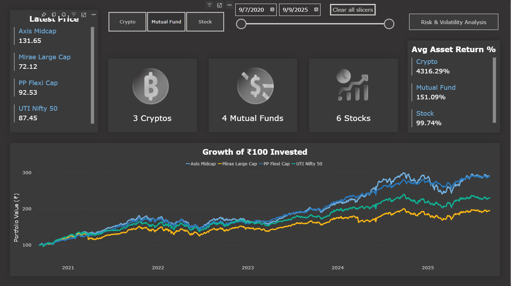
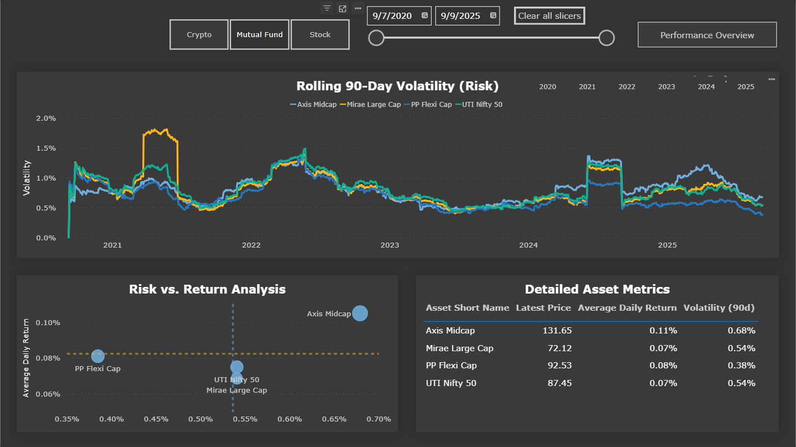
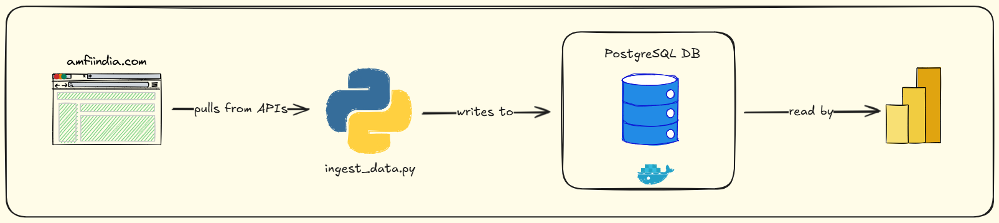

# Unified Investment Portfolio Dashboard


An end-to-end data analytics project that builds an automated data pipeline and a comprehensive Power BI dashboard to track and analyze a diversified Indian investment portfolio, including Stocks, Mutual Funds, and Cryptocurrencies.

---

## 📊 Live Power BI Dashboard

This interactive dashboard provides a unified view of asset performance, risk, and volatility, solving the common problem of tracking disconnected investments on a single platform.

**[>> Click Here to View the Live Dashboard <<](https://app.powerbi.com/groups/me/reports/4564da59-6dc0-435d-8a3e-0849bf925d13/3762545e4448a289dc7c?experience=power-bi)**

#### Performance Overview


#### Risk & Volatility Analysis


---

## 🎯 Project Motivation

The goal of this project was to address a common challenge for retail investors: the lack of a single, unified platform to compare the performance and risk of fundamentally different asset classes. An investor's portfolio is often fragmented across various apps (a stock broker, a mutual fund platform, a crypto exchange).

This dashboard centralizes data from these diverse sources to answer critical questions like:
*   How does the performance of my Nifty 50 ETF compare to my tech stocks?
*   Which of my assets provides the best risk-adjusted return?
*   Is there a correlation between the volatility of my crypto and stock investments?

---

## ⚙️ Architecture & Tech Stack

This project was built using a modern, local data stack, simulating a professional data engineering workflow.



1.  **Containerization (Docker):** A **PostgreSQL** database was run in a Docker container using a `docker-compose.yml` file. This ensures a consistent, isolated, and persistent environment for the data warehouse.

2.  **Data Ingestion Pipeline (Python):**
    *   An automated Python script (`ingest_data.py`) was developed to perform data extraction.
    *   **Libraries:** `yfinance` for NSE stocks & crypto, `requests` for historical mutual fund NAVs from AMFI.
    *   **Logic:** The script implements an **incremental load** strategy. It intelligently checks the latest date in the database and only fetches new, missing data, making the daily updates highly efficient.
    *   **Configurable:** The list of mutual funds along with their codes as mentioned in `MF_CODES` is available in a `metadata/mutual_funds.json` file.

3.  **Data Modeling & Visualization (Power BI):**
    *   Power Query was used for data transformation, including cleaning, standardizing, and appending the disparate data sources into a unified fact table.
    *   A robust data model was built with a `Dim_Date` table and a dedicated `Tbl_Measures` table, following industry best practices.
    *   Advanced **DAX** was written to calculate complex, context-aware metrics like `Total Return %`, rolling `Volatility (90d)`, and `Growth of ₹100`.

---

## 👨‍💻 Code & Logic Highlights

This section showcases some of the key code snippets that power the project's automation and analytics.

### Python: Incremental Data Ingestion

The core of the pipeline is its ability to perform incremental loads. The script checks the latest date in the database and only fetches the delta, making daily runs extremely efficient.

```python
# Snippet from scripts/ingest_data.py

def get_last_ingest_date(table_name, engine):
    """
    Finds the most recent date for data in a given table.
    Returns None if the table is empty or doesn't exist.
    """
    try:
        # Use inspector at engine level to check table existence
        inspector = inspect(engine)
        if not inspector.has_table(table_name):
            logging.info(f"Table '{table_name}' does not exist. A full load will be performed.")
            return None

        # Use sqlalchemy.text() for textual SQL in SQLAlchemy 2.x
        with engine.connect() as connection:
            query = text(f"SELECT MAX(date) AS max_date FROM {table_name};")
            result = connection.execute(query).scalar()
            if result:
                logging.info(f"Last ingest date for '{table_name}' is {result}.")
                return result
            else:
                logging.info(f"Table '{table_name}' is empty. A full load will be performed.")
                return None
    except Exception as e:
        logging.error(f"Error checking last ingest date for '{table_name}': {e}")
        # In case of error, better to do a full load than to miss data
        return None
```

### DAX: Rolling Volatility Calculation

Calculating a rolling standard deviation requires careful handling of evaluation context. This measure iterates through a 90-day window and calculates the daily return for each day before computing the final volatility.

```dax
-- Snippet from dax/key_measures.dax

Volatility (90d) = 
VAR DateRange = 
    DATESINPERIOD(
        'Dim_Date'[Date],
        MAX('Dim_Date'[Date]),
        -90,
        DAY
    )
RETURN
    STDEVX.P(
        DateRange,
        [Daily Return %]
    )
```
*(The full DAX library can be found in the `/dax/` directory.)*

---

## 📈 Key Metrics & Features

The dashboard provides insights through several key calculations:

*   **Growth of ₹100:** Normalizes the starting point of all assets to ₹100 to provide a fair and direct performance comparison over time.
*   **Total Return %:** A robust measure that calculates the total return for each asset based on its own unique start and end dates.
*   **Volatility (90d):** A rolling 90-day standard deviation of daily returns, serving as the primary measure of an asset's risk or price instability.
*   **Risk vs. Return Scatter Plot:** A powerful visual that plots each asset's average return against its volatility, allowing for immediate identification of high-performing and high-risk assets.
*   **Consistent Design:** The report utilizes a consistent color palette and typography, outlined in the project's **[Theme.json](./metadata/Theme.json)**, to ensure a professional and intuitive user experience.

---

## 🚀 How to Run this Project Locally

1.  **Prerequisites:** Ensure you have Docker Desktop installed and running.
2.  **Clone the Repository:**
    ```bash
    git clone https://github.com/bISTP/Unified-Investment-Portfolio-Dashboard.git
    cd Unified-Investment-Portfolio-Dashboard
    ```
3.  **Launch the Database:** From the root directory, start the PostgreSQL container.
    ```bash
    docker-compose up -d
    ```
4.  **Install Python Dependencies:**
    ```bash
    pip install pandas yfinance sqlalchemy psycopg2-binary requests
    ```
5.  **Run the Ingestion Pipeline:** Execute the script to populate the database. The first run will be a full 5-year historical load and may take a few minutes. Subsequent runs will be very fast.
    ```bash
    python scripts/ingest_data.py
    ```
6.  **View the Dashboard:** Open the `Unified_Investor_Dashboard.pbix` file. You may need to refresh the data source to connect to your local PostgreSQL instance.